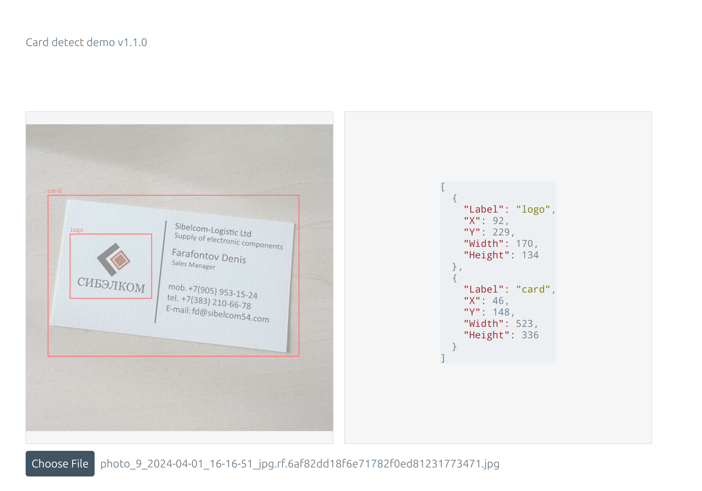
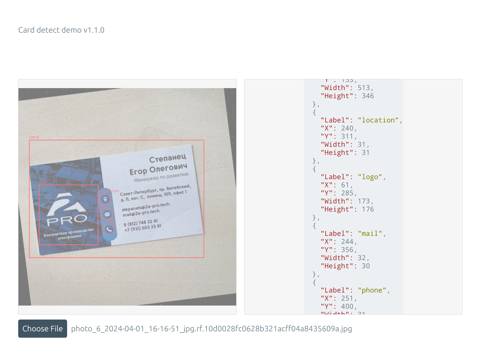

# Пример использования onnx модели в go.

Используется onnx runtime и модель, которая ищет визитку на фото и различные составляющие.

Сборка в докере:
```
docker build -t card-detect-demo:latest .
docker run -p 8080:8080 -d card-detect-demo:latest
```

UI тут localhost:8080





